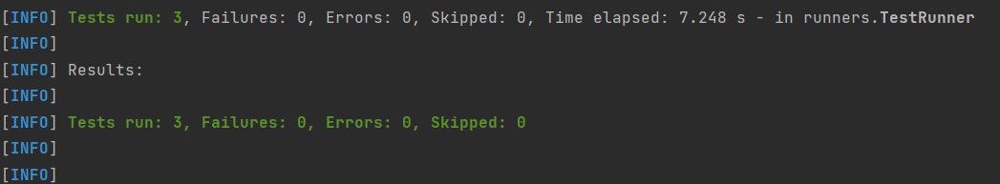
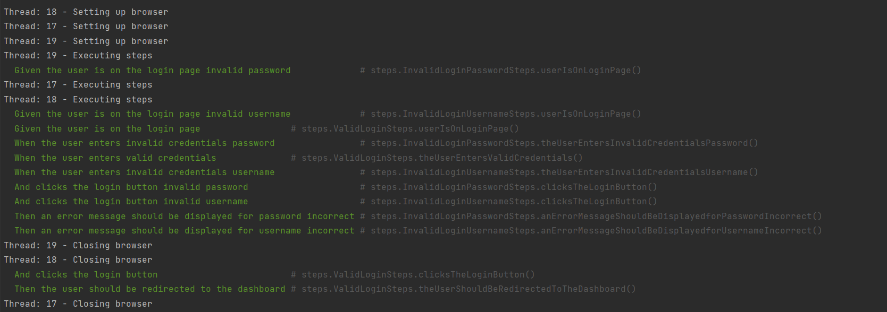

# **Project Title**
_Selenium Login Testing Example_

---

## **Table of Contents**

1. [Overview](#overview)
2. [Features](#features)
3. [Getting Started](#getting-started)
4. [Installation](#installation)
5. [Usage](#usage)
6. [Explanation](#explanation)
7. [Library](#library)
8. [Contact](#contact)

---

## **Overview**
This project is a selenium based example for Login Testing with Java language

---

## **Features**
Simple login scenario consist of
- Login with valid username and password
- Login with invalid username
- Login with invalid password

It can be run with Parallel Running.

---

## **Getting Started**

### Prerequisites
List any requirements for using or running your project:
- Java 11
- Chromedriver (based on your own support browser)
- Maven 3.9.9

### Installation

1. Clone the repository:
   ```bash  
   git clone https://github.com/ryannaufalp/login-selenium-example.git  

2. Navigate to project directory:
    ```bash  
   cd Login-Selenium
   
3. Installation dependencies:
    ```bash  
       mvn clean install

## **Usage**
How to run all test:
```bash   
   mvn test
```
or can run directly on TestRunner.java

## **Explanation**

### Login page for testing
Special thanks for this page for dummy login page provided for testing.
```https
https://practicetestautomation.com/practice-test-login/
```

### Files explanation
1. ```test/java/runners/TestRunner.java```
It is used to configure and execute your feature files and step definitions


2. ```test/java/utils/DriverManager.java```
Utility class responsible for managing the WebDriver instances used in your Selenium tests


3. ```test/java/steps```
Maps Gherkin steps (from .feature files) to Java methods and contains the code that executes the required actions.
It is consist of:

    3.1 ```test/java/steps/ValidLoginSteps.java```
   for scenario Login with valid username and password

    3.2 ```test/java/steps/InvalidLoginUsernameSteps.java```
   for scenario Login with invalid username

    3.3 ```test/java/steps/InvalidLoginPasswordSteps.java```
   for scenario Login with invalid password


4. ```test/resources/features/Login.feature```
   Cucumber feature file that contains test scenarios written in Gherkin syntax

### Testing result

All test case is already passed

### Parallel running

This shows that:

    1. Threads 17, 18, and 19 are running in parallel.
    2. Each thread executes its own test steps independently.
    3. Browsers are created and destroyed separately for each thread.


## **Library**
### 1. selenium
for automate web applications for testing
### 2. cucumber
for define test cases using gherking syntax
### 3. testng
for functional testing related, for parallel testing also need to use this library
### 4. junit
annotation and validation related
### 5. maven related library
to ensure all class can connected and can run properly

### Other detail
For detail library that used for this project can see on ```pom.xml```

## **Contact**
- Email: ryan.n.pioscha@gmail.com
- LinkedIn: https://www.linkedin.com/in/ryan-naufal-pioscha/
- GitHub: @ryannaufalp